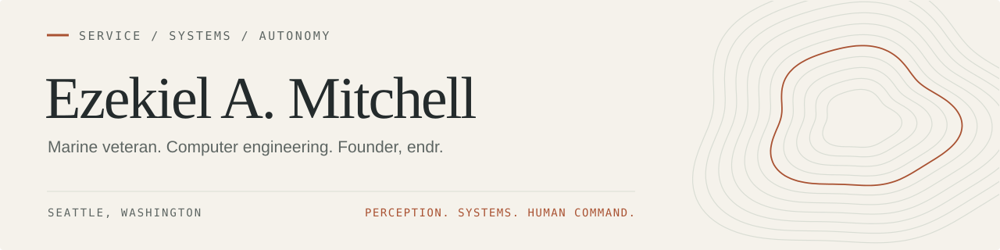

<picture>
  <source media="(max-width: 600px) and (prefers-color-scheme: dark)" srcset="images/profile-header-mobile-dark.svg">
  <source media="(max-width: 600px)" srcset="images/profile-header-mobile-light.svg">
  <source media="(prefers-color-scheme: dark)" srcset="images/profile-header-dark.svg">
  
</picture>

  <a href="https://ezekielamitchell.com">Website</a> &nbsp; / &nbsp;
  <a href="https://www.linkedin.com/in/ezekielmitchell/">LinkedIn</a> &nbsp; / &nbsp;
  <a href="mailto:ezekielmitchll@gmail.com">Email</a> &nbsp; / &nbsp;
  <a href="https://github.com/endrhq">endr</a>

I'm Ezekiel — a **U.S. Marine Corps veteran**, Computer Engineering student at **Seattle University**, and founder of **[endr](https://www.endrhq.com)**.

I'm focused on defense autonomy, with a particular interest in perception, reliable software, and how people stay in command. My path runs from military service to embedded systems and computer vision; this is where I share the engineering along the way.

### What I'm focused on

- **Building endr.** A battlefield AI company developing autonomy software through a research- and simulation-first approach.
- **Sharpening the fundamentals.** Python, Rust, Linux, and Git through small command-line tools, shared test cases, and clear documentation.
- **Finishing my degree.** B.S. Computer Engineering, expected December 2026. Also learning Mandarin.

### Selected work

| Project | What you'll find |
| :--- | :--- |
| **[Winter River](https://github.com/ezekielamitchell/ECE-26.1-Winter-River)** Team capstone | A modular data-center training simulator: ESP32 nodes, MQTT, and a Python simulation engine. Developed with a five-person Seattle University team. |
| **[project-aegis](https://github.com/ezekielamitchell/project-aegis)** Robotics prototype | Python perception and temporal verification alongside a Rust control module. Hardware integration remains unfinished. |
| **[GUARDEN](https://github.com/ezekielamitchell/GUARDEN)** IoT prototype | Garden monitoring with camera-node firmware, MQTT ingestion, and a local dashboard. |
| **[defense-foundations](https://github.com/ezekielamitchell/defense-foundations)** Learning in public | Python and Rust practice, small programs, and the foundations behind more ambitious systems. Work in progress. |

### How I think about the work

I care about understanding the whole system: what it senses, how it fails, and what the person using it needs to know. Clear interfaces, reproducible tests, and honest limitations are the standard I'm working toward.

If you're working on perception, embedded systems, or human-machine teaming, I'd like to compare notes.

---

Seattle, Washington · Service, curiosity, and a long-term commitment to the craft.
